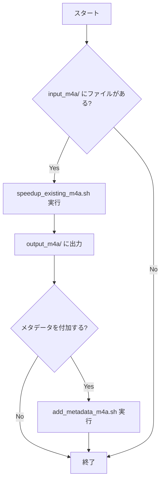

# M4A ファイルへのメタデータ追加

> 🚧 **Note: This document contains initial design specifications. For the latest implementation details, please refer to the [README](../add_metadata/README.md).**

## 開発方針検討

GitHub の共同創業者である Tom Preston-Werner が提唱する「Readme Driven Development」という考え方に興味を持ったので、今回はまずは README から開発を始めることにしました。

ので、まずは README を書くために何をやりたいかの整理をここにします。

## やりたいこと

M4A ファイルに以下のメタデータの追加です：

- アーティスト名: "AI らじお"
- コンピレーションフラグ: オン

## 使用技術の検討

今回 AtomicParsley という CLI ツールでメタデータ編集をすることにしました。

> [AtomicParsley](https://github.com/wez/atomicparsley) is a lightweight command line program for reading, parsing and setting metadata into MPEG-4 files, in particular, iTunes-style metadata.

例：

```bash
AtomicParsley ファイル名.m4a --artist "AIらじお" --compilation 1 --overWrite
```

テストしたら問題なかったです。簡単すぎたのでもっと前からこのやり方で音楽ファイルの metadata を編集してたらよかったなと思ったくらいです。

### スクリプト設計の検討

- 新規スクリプト名: `add_metadata_m4a.sh`
- モジュール化の方針:
  - `speedup_existing_m4a.sh`と連携可能
    - 既存のスクリプトと連携できたら楽かと思いました
  - 単独実行も可能
    - 単独でも実行できるようにしといた方がシンプルなはずです

## 処理フローの検討



## 実装のポイント整理

1. ユーザーインターフェース

   - メタデータ追加の確認プロンプトを表示
   - yes/no で選択可能

2. モジュール性

   - 既存の倍速処理スクリプトとの連携
   - 独立した機能としても使用可能

3. ファイル管理
   - 配置場所: `speedup_m4a_only/` ディレクトリ配下
   - 入力: `speedup_m4a_only/input_m4a/` ディレクトリ
   - 出力: `speedup_m4a_only/output_m4a/` ディレクトリ

## ディレクトリ構造の検討

２案あったのでトレードオフを考えました。

### 案 1: `speedup_m4a_only`内に配置

メリット：

- パスの参照がシンプル（相対パスが簡単）
  - 実際の影響: スクリプト内での相対パスが`./input_m4a/`のように短く書ける
  - ただし、これは開発時の利便性であり、ユーザー体験への影響は限定的

デメリット：

- README の管理が難しい（既存の README と混ざる）
  - 既存の README に機能を追加する場合、以下の課題がある：
    1. 既存の説明文脈を崩さないように注意が必要
    2. 機能の説明が分散する可能性がある
    3. 更新履歴の管理が複雑になる
  - 別ファイルで管理する場合：
    1. どのファイルに何が書いてあるかの把握が必要
    2. ファイル間の参照関係が複雑になる
    3. メンテナンスコストが増加

### 案 2: 独立した`add_metadata`ディレクトリを作成

メリット：

- 機能の独立性が明確
- README の管理が容易
  - 機能ごとに独立した README を管理可能
  - 更新履歴が明確
  - 機能の説明が一箇所にまとまる

デメリット：

- パスの参照が複雑（`../speedup_m4a_only/input_m4a/`など）
  - 実際の影響: スクリプト内での相対パスが長くなる
  - ただし、これは開発時の一時的な問題で、実行時には影響しない
  - シンボリックリンクや環境変数で解決可能

### 結論

今回のケースでは、**案 2 の独立した`add_metadata`ディレクトリを作成**を採用する

1. README の管理の容易さが、パスの参照の簡潔さよりも重要

   - ドキュメントの保守性は長期的なプロジェクトの成功に直結
   - パスの参照は技術的な問題で、様々な方法で解決可能

2. 機能の独立性が明確

   - 各機能の責務が明確に分離される
   - 将来的な機能追加や変更が容易

3. ユーザー体験の向上

   - 機能ごとの説明が分かりやすい
   - 必要な情報にすぐにアクセス可能

4. メンテナンス性の向上
   - 更新履歴の管理が容易
   - 機能の説明が一箇所にまとまる
